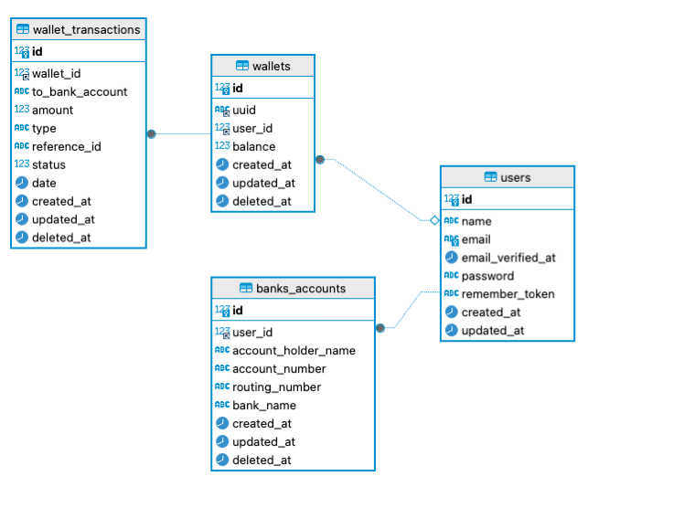

# Personal Wallet

This is a Laravel-based wallet application that provides functionalities for managing user funds. It includes features for adding funds, transferring funds, viewing transaction history, withdrawing funds, generating PDFs of transactions, and generating QR codes for easy transfers. The project also incorporates JWT authentication, data encryption, and is optimized to handle up to 1000 concurrent transactions with a processing time of less than 2 seconds.

## Features

- **Add Funds**: Users can add funds to their wallet.
- **Transfer Funds**: Users can transfer funds to other users.
- **View Transaction History**: Users can view their transaction history.
- **Withdraw Funds**: Users can withdraw funds from their wallet.
- **Generate PDFs**: Users can generate PDF reports of their transactions.
- **QR Code Generation**: Users can generate QR codes for easy transfers.
- **JWT Authentication**: Secure user authentication using JSON Web Tokens.
- **Data Encryption**: Ensures that sensitive data is encrypted.
- **High Performance**: Capable of handling up to 1000 concurrent transactions with processing times under 2 seconds.

## Installation

1. Clone the repository:

    ```bash
    git clone https://github.com/tamer-dev/personal-wallet.git
    ```

2. Navigate to the project directory:

    ```bash
    cd personal-wallet
    ```

3. Install the dependencies:

    ```bash
    composer install
    ```

4. Copy the `.env.example` file to `.env`:

    ```bash
    cp .env.example .env
    ```

5. Generate the application key:

    ```bash
    php artisan key:generate
    ```

6. Set up your database configuration in the `.env` file:

    ```
    DB_CONNECTION=mysql
    DB_HOST=127.0.0.1
    DB_PORT=3306
    DB_DATABASE=your_database_name
    DB_USERNAME=your_database_username
    DB_PASSWORD=your_database_password
    ```

7. Run the database migrations:

    ```bash
    php artisan migrate
    ```

8. Start the development server:

    ```bash
    php artisan serve
    ```


## Usage

- **Add Funds**: Use the endpoint `/api/v1/wallet/add-funds` to add funds to your wallet.
- **Transfer Funds**: Use the endpoint `/api/v1/wallet/transfer-funds` to transfer funds to another user.
- **View Transaction History**: Use the endpoint `/api/v1/wallet/transactions` to view your transaction history.
- **Withdraw Funds**: Use the endpoint `/api/v1/wallet/withdraw-funds` to withdraw funds.
- **Generate PDFs**: Use the endpoint `/api/v1/wallet/transactions/pdf` to generate a PDF of your transactions.
- **Generate QR Code**: Use the endpoint `/api/v1/wallet/transfer/qr-code` to generate a QR code for easy transfers.

## ERD Diagram



## API Documentation
Detailed API documentation can be found in the `docs` directory or at [API Documentation](./docs/Wallet_API.postman_collection-last.json).

Postman Collection at [Postman collection](./docs/api-documentation.md).
